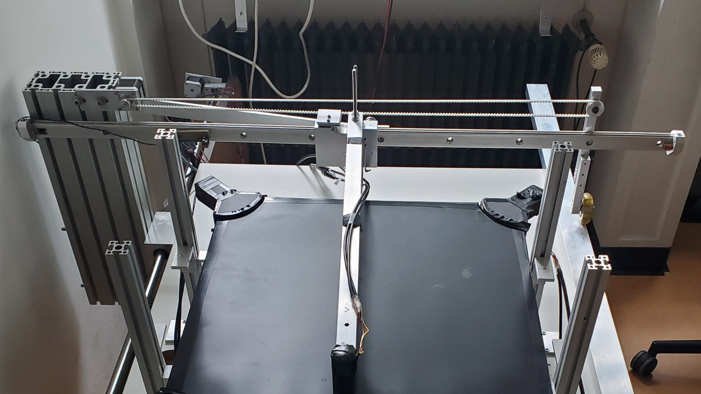
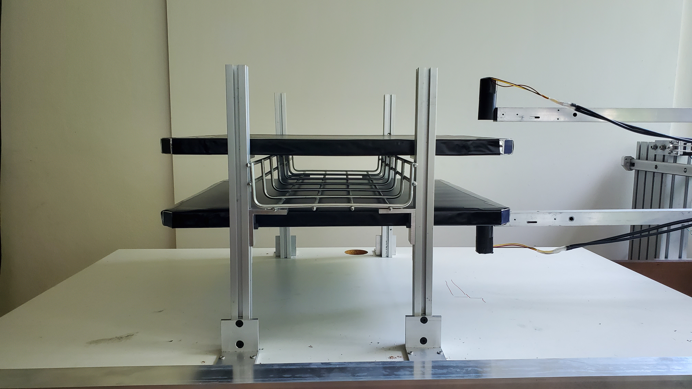

# Frame Assembly
This section will explain the design considerations for the development of the muon scanner. Design influences drawn from Computer Numeric Control (CNC) machining methods to PMT calibrations are utilized with the aid of rapid prototyping methods, such as Fused Deposition Modelling (FMD).

  | Finalized Design |
  | :---: |
  ||

The entire scanner was mounted directly onto a spared table. This was done not only due to the availability of tables but it also allows the unit to be quite portable and fit through a standard doorway.

## Axis Movement
Once the table was selected, a method for xy-axis scanning was needed. The movement was heavily inspired by CNC routers and uses a combination of belt-driven and gear-driven movement.
+ [ ] **Y-axis:** uses a large spiral gear that runs along the long length of the table.
+ [ ] **X-axis:** uses a belt drive that spans over the top of the table.

### Y-axis
Mounted onto the spiral gear there is a stepper motor that is controlled by an Arduino. The rotation of the stepper motor is transferred to the spiral gear through a small belt. As the spiral gear turns, a large vertical aluminum profile follows the gearing. This mechanism determines the y-axis movement.
  | Y-Axis Spiral Gear & Stepper Motor|
  | :---: |
  ||

### X-axis
Mounted onto the larger vertical aluminum profile, a second stepper motor can be found. This stepper motor directly drives a belt. The belt is then attached to two horizontal scanning arms that will eventually house the coincidence PMTs.

  | X-Axis Belt Drive & Stepper | Belt Drive & Scanning Arms |
  | :---: | :--:|
  ||

## Aluminum Profile
Once a table was selected, four alumin

  | Finalized Design |
  | :---: |
  ||
