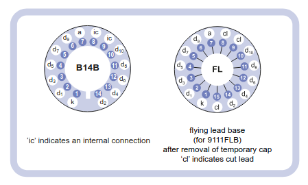
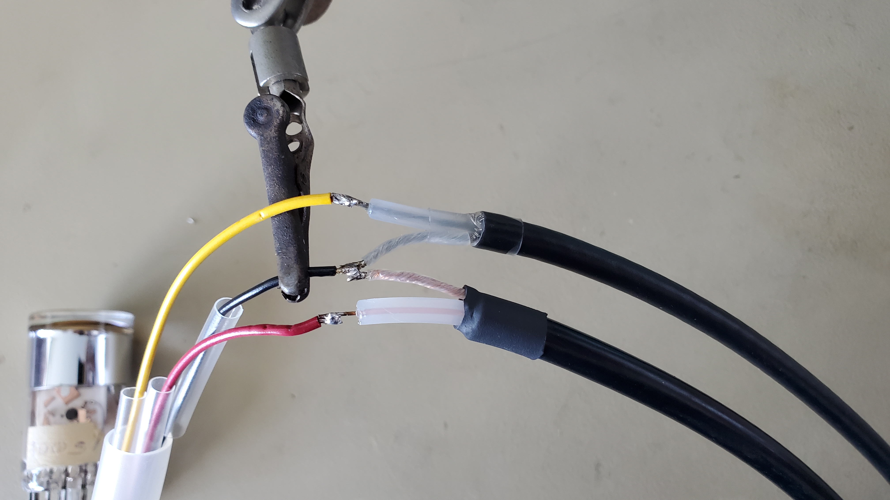
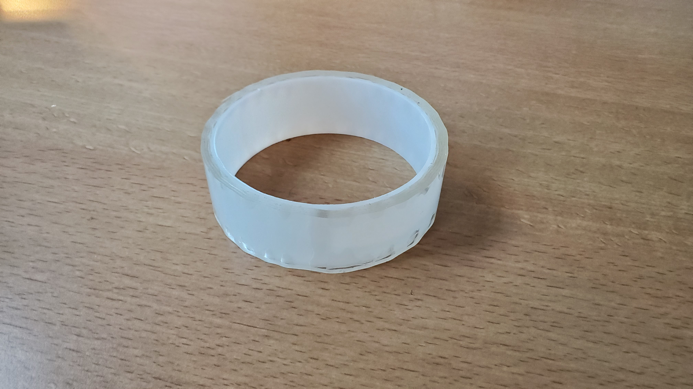
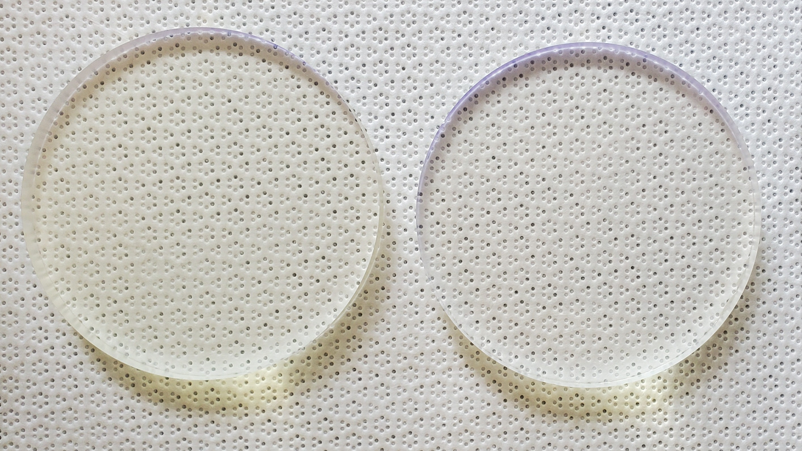

# Photomultiplier Tube Prep & Mounting

| PMT 9111B Series| 9111B Wiring Diagram |
| :--: | :--: |
|||

## 9111B Series PMT
The PMTs used in this project are 25 mm diameter 9111B series photomultipliers from ET Enterprises. They use a transmission type plano-concave window with a blue-green sensitive bialkali photocathode. The dynodes, composed of SbC, are circularly focused, which improve the timing, stability, and gain of the unit. There are 10 dynodes total, each with trimmable leads arranged on the bottom of the PMT. Refer to the [9111B series data sheet](../Documents/Literature/9111B_datasheet.pdf) for more detailed product specifications.

> [!WARNING]
> Due to the nature of the PMTs, high voltages must be properly considered for efficient transmission and safety.

High-voltage cables consist of several key components: a conductor, usually made of copper or aluminum, which carries the electrical current; insulation layers to prevent electrical leakage; a metallic shield to manage electric fields and contain electromagnetic interference; and an outer protective sheath to safeguard the cable from physical damage and environmental factors. These layers ensure both safety and efficiency in high-power transmission systems.

## Step 1: Connecting the Voltage Divider
Connecting the PMT properly to the voltage divider was the first stage. Each PMT consists of 10 connector pins, see figure 3.6, that need to be soldered to the voltage divider. The voltage divider is mounted on a separate printed circuit board (PCB), along with a negative high-voltage. The negative high-voltage is fed directly to the photocathode on the PMT housing. Connections can be seen by following the wiring schematic shown above.

## Step 2: Connecting the PMT to the High-Voltage (HV) & Signal Cables
> [!NOTE]
> Initially a custom circuit on a PCB was designed to handle the output of the PMT after the voltage divider, with the thought of needing a capacitor with the data line to stabilize potential signal spikes.

This design was eventually updated to not need the capacitor due to a noisier signal caused by a shift in the ground levels. Once the capacitor was removed, proper operation was checked by measuring the resistance between the ground and signal. A PMT in good working condition was calculated to have a resistance of ≈ 475 kΩ.

<table>
    <thead>
        <tr>
            <th>PMT to Cable Wiring</th>
            <th>Cable Type</th>
            <th>Soldered Connection</th>
        </tr>
    </thead>
    <tbody>
        <tr>
            <td rowspan=3></td>
            <td rowspan=2>HV Cable</td>
            <td> Red PMT Power -> HV Power</td>
        </tr>
        <tr>
            <td>PMT Ground -> HV/Signal Ground</td>
        </tr>
        <tr>
            <td rowspan=1>Signal Cable</td>
            <td>Yellow PMT Signal -> Signal Cable</td>
        </tr>
    </tbody>
</table>

Once these connections are made, it is recommended to heat shrink each cable individually to avoid short circuiting the system. These can be seen in the image as clear heat shrink. The entire connection was also surrounded with heat shrink to keep everyting neat and organized $${\color{orange}(optional)}$$. 

## Step 3: Mounting the Coincidence PMTs
Both the coincidence scanning arms and the large plate scintillator need PMTs mounted to them. Let's start with the scanning arms.

Using fused deposition modelling (FDM) print methods, custom housings were designed and printed using black 1.25 mm polylactic acid (PLA) filament to mount the coincident PMTs and their respective scintillators to the scanning arms. Below are images of the housing iteslf and how it interacts with the scanning arm. 

| Coincident PMT Housing| Housing Mounted|
| :--: | :--: |
|||

Before the PMT is slid into this housing, a small scintillator with the same diameter as the PMT is taped to the glass face of the PMT using nano-tape. The tape is wrapped in aluminum and the entire module is then slide into the housing. Below is a photo of the brandless nano-tape that was used as well as the cylindrically cut scintillators that were taped to the PMT with the nano-tape.

| Nano-Tape | Cylindrical Scintillators |
| :--: | :--: |
|||

## Step 4: Mounting the Large Scintillator Plate PMTs
Next the large scintillation plate had it's 4 PMTs mounted at each corner. Since each corner of the scintillator was left unpainted and free from aluminum and plastic wrap, the PMTs were taped to each corner with the nano-tape and the FMD printed housings were secured around them.

| Corner Housing Open | Corner Housing Closed |
| :--: | :--: |
|||

## Step 5: Preventing Light leak
Once all of the PMTs are securely mounted, the all housings are taped with electrical tape to prevent unwanted light from sneaking in. The completed taping can be seen below.

| Taped Housings |
| :--: |
||
