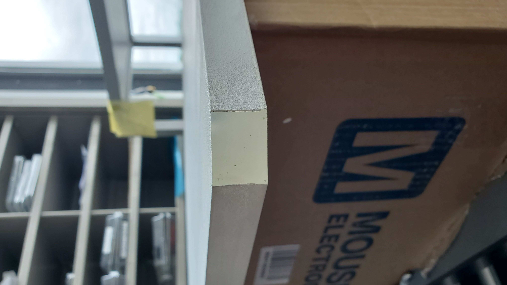
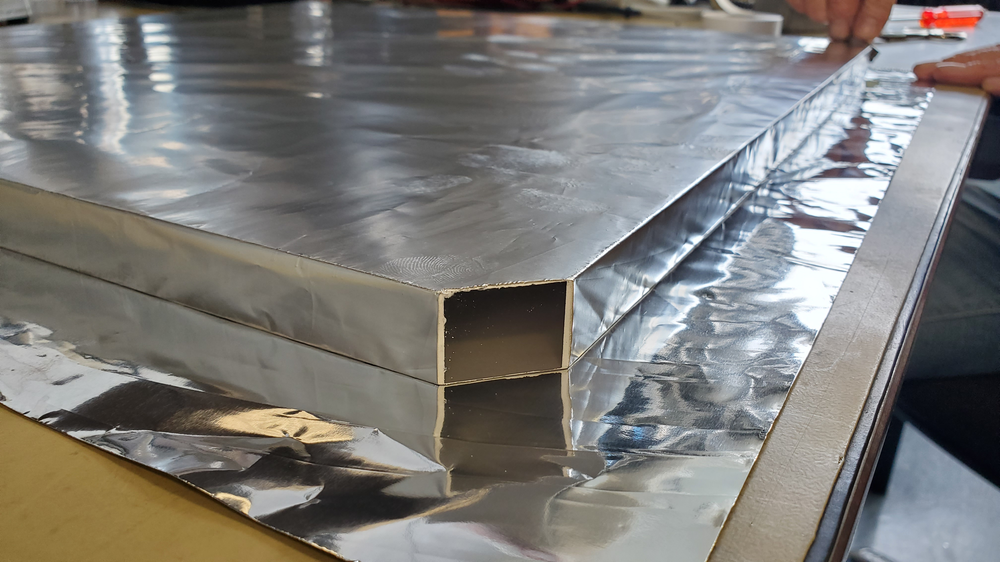
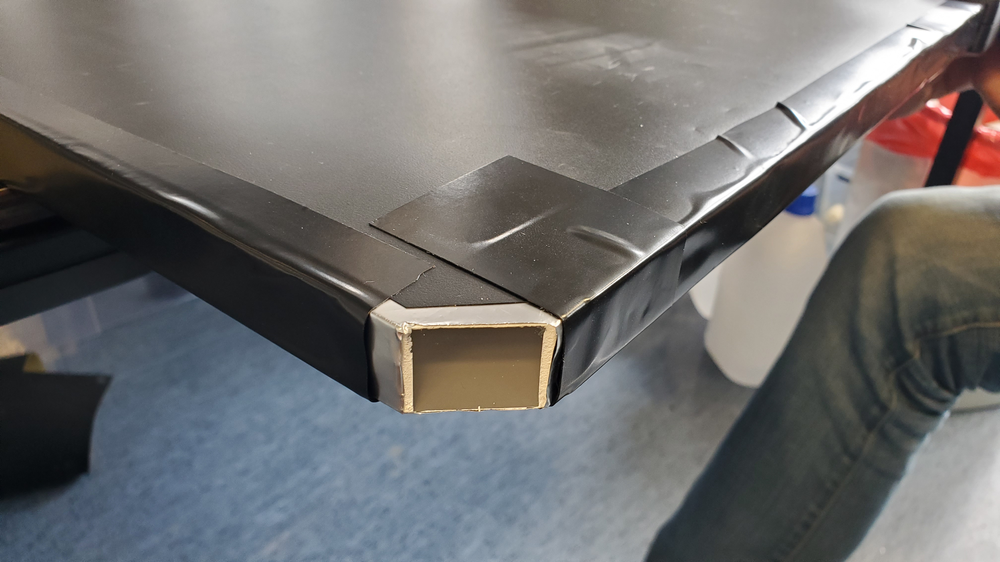

# Scintillator Prep & Mounting
Before the scintillators can be used for detecting muons, the surfaces must be prepared to improve the output of signal detection.

> [!NOTE]
> Do not cover the mounting points on each corner of the large scintillator panels. There needs to be a clean surface for the photons to be transmitted from the scintillator to the PMT.

## 1. Reflective Paint
First, [EJ-510](https://eljentechnology.com/products/accessories/ej-510) refelctive paint was applied to every surface (except where the PMTs will mount). Manufactured by Eljen Technologies, this paint was designed for reflecting blue emitting scintillators. A maximum reflectivity around 98% is then achieved with $${\color{lightgreen}three \space to \space four \space coats}$$ of paint for a scintillator that emits wavelengths down to 425 nm.
| EJ-510 Reflective Paint Application | PMT Mounts Kept Clean |
| :--: | :--: |
|||

## 2. Aluminum Foil
Second, to further promote internal reflections, standard aluminum foil (∼ 16 &mu;m) was wrapped around the plate scintillator. The corners were once again left untouched.
| Aluminum Foil Wrap |
| :--: |
||

## 3. Plastic Liner
Once the aluminum foil was wrapped around the scintillator, a layer of multipurpose protective material was custom fit and taped to the surface. The plastic liner, roughly 0.25 mm thick, creates a light-tight seal to reduce the probability of photon contamination. Photon contamination normally occurs when an exterior source of light reaches the photomultiplier tube. For example, this could be contamination light from the sun.
| Plastic Liner Wrap | PMT Mounts Kept Clean |
| :--: | :--: |
|||
