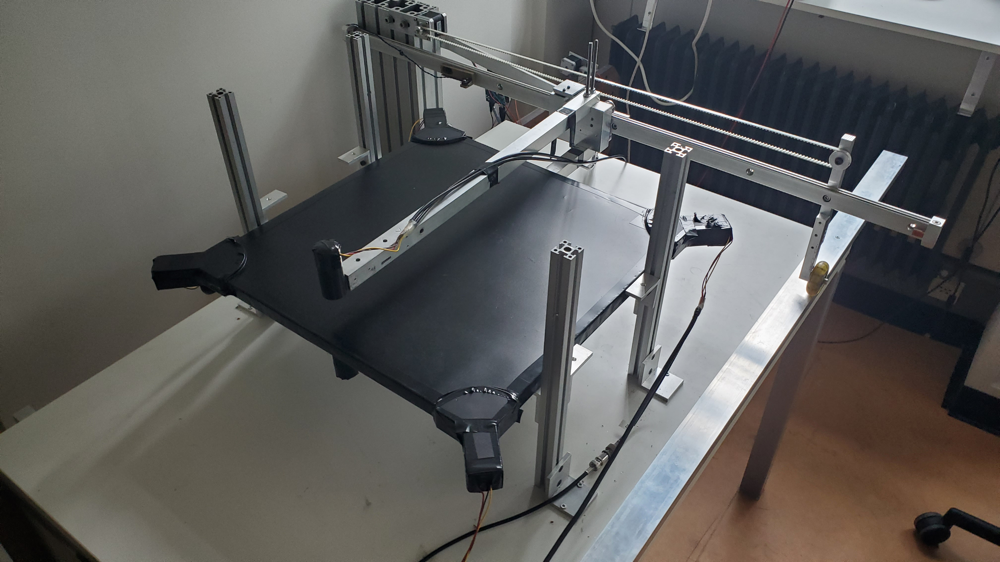

# Table-Top-Muon-Tomography Experiment
Documentation for building the open source Cost Effective Table-Top Muon Tomography Experiment at Utrecht University.

Muography (or muon tomography) is an imaging technique that uses cosmic muons—high-energy particles produced when cosmic rays interact with Earth's atmosphere—to create detailed images of the interior of objects. Muons are highly penetrating, much like X-rays but at much higher energies, allowing them to pass through thick and dense materials, such as mountains, buildings, or industrial structures.

## Experiment Goal
This thesis aims to explore the early development stage of a table top, cost-effective, muon tomography scanner through the use of **photomultiplier tubes (PMTs)** and organic scintillators. By establishing a proof-of-concept, the experiment suggests pathways for further development, potentially expanding the applications of muon imaging in research, education, and low-budget experimental environments. The performance of the scanner is validated through multi-hour test scans using known densities. Final results are documented in preparation for future adaptations of the experiment.

## Main Features
This experiment uses second hand materials for most of its construction and feature the BC408 plastic scintillators are recycled from the [HiSPARC](https://hisparc.utah.edu/) project, started in the Netherlands in 2003.
+ __BC408 Scintillators:__
  + Dimensions: 100 cm X 50 cm X 2 cm
  + Composition: Polyvinyltoluene

+ __9111B PMTs__
  + Diameter: 25 mm
  + Dynode Chain: Circular Focused

## Build Instructions
Step by step instructions to assemble the hardware of the muon scanner:
1. [Frame Assembly](Documents/BuildInstructions/FrameAssembly.md)
2. [Scintillator Prep & Mounting](Documents/BuildInstructions/Scintillator.md)
3. [PMT Prep & Mounting](Documents/BuildInstructions/PMT.md)
4. [Electronics & Wiring](Documents/BuildInstructions/Electronics.md)
   
## Operational Instructions
Step by step instructions how to run a test on the muon scanner:
1. [Arduino Setup](Documents/OperationalInstructions/Arduino.md)
2. [Oscilloscope Setup](Documents/OperationalInstructions/Oscilloscope.md)
3. [ROOT/C++ Analysis](Documents/OperationalInstructions/ROOTanalysis.md)

## Future Development
Looking ahead, there are several avenues for future work that could enhance the performance and utility of this muon tomography scanner. 
1. Longer timescales for scans could significantly improve the resolution of the system, allowing for finer distinctions between materials and more detailed density mapping. 
2. Optimizing the data acquisition process would be crucial to maximizing the efficiency of the scanner and ensuring high-quality data collection.
3. Introducing artificial neural networks could aid in taking pulse data and mapping where the muon hits occured on the scintillator plates.

## ERP 2025
The summary of the Experimental research project 2025 can be found [here](ERP%202025/Summary.md)

## Additional Resources
More information about scintillators
- [ ] [BC408 Datasheet](Documents/Literature/bicron_datasheet.pdf)
 

More information about Photomultiplier Tubes
- [ ] [9111B Datasheet](Documents/Literature/bicron_datasheet.pdf)

